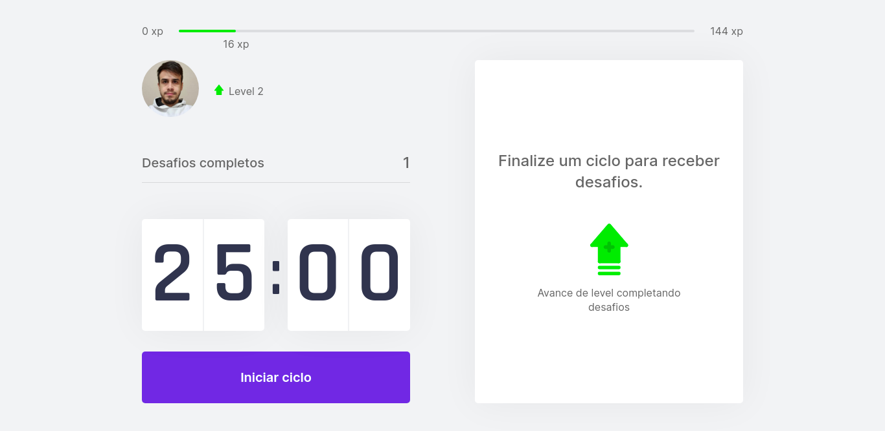
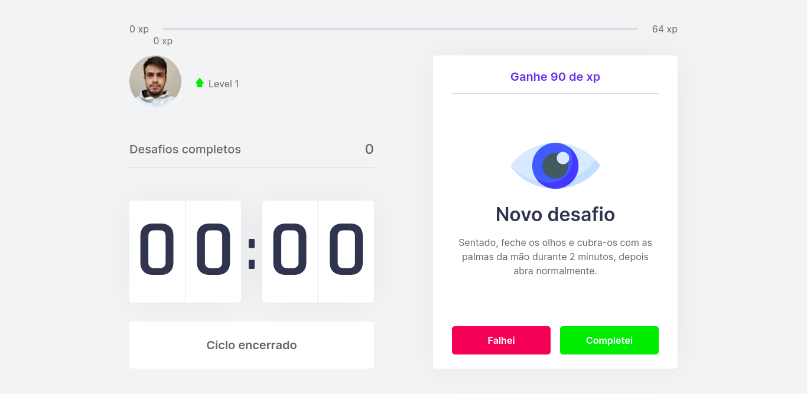
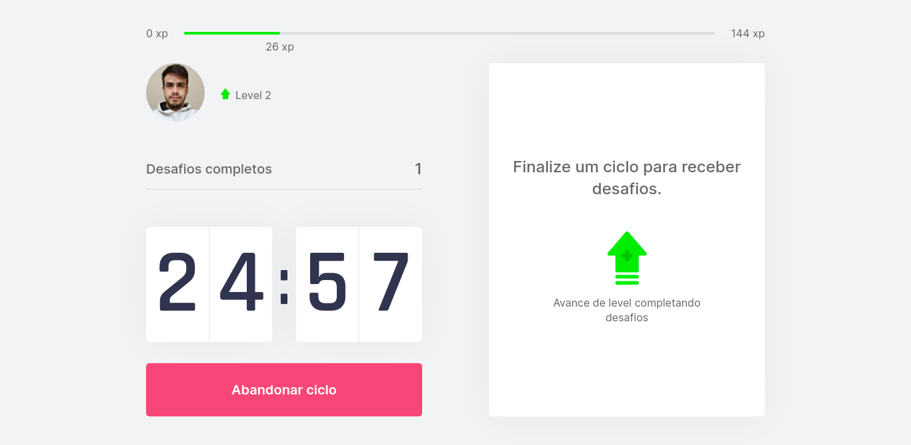

<h1 align="center">MoveIt</h1>
<p align="center">
    </img>
</p>

  <p align="center">
 <a href="#screenshots">Screenshots</a> -
 <a href="#sobre">Sobre</a> - 
 <a href="#tecnologias">Tecnologias</a> - 
 <a href="#pre-requisitos">Pré-requisitos</a> - 
 <a href="#run">Rodando o projeto</a>
</p>


<h2 id=screenshots>📸 Screenshots</h2>

<h1 align="center">
<div style="display: flex; flex-direction: row;">
  
  
  </div>
  <div style="display: flex; flex-direction: row;">
  
  
  </div>
</h1>

<h2 id="sobre">🍅 Sobre</h2>

<p align="center">Esta aplicação temo como finalidade ajudar o usuário com o controle de tempo e produtividade, e para isso faz uso da técnica pomodoro, onde intercalam-se momentos de concentração total e breves pausas para realizar pequenos exercícios.</p>

<h2 id="tecnologias">👨‍💻 Tecnologias Utilizadas</h2>

- ReactJS
- NextJS
- TypeScript
- Yarn

<h2 id="pre-requisitos">🔑 Pré-requisitos</h2>
Antes de começar, você vai precisar ter instalado em sua máquina as seguintes ferramentas: 

[Git](https://git-scm.com/),
[Node.js](https://nodejs.org/en/) e
[Yarn](https://yarnpkg.com/getting-started).
Além disto é bom ter um editor para trabalhar com o código como [VSCode](https://code.visualstudio.com/).
<h2 id="run">🏃 Rodando o projeto em sua máquina</h2>


```console
# Clone este repositório
$ git clone https://github.com/arsmcosta/moveit-next

# Acesse a pasta do projeto no terminal/cmd
$ cd moveit-next

# Instale as dependências
$ yarn install

# Inicie o server
$ yarn dev

# O servidor inciará na porta:3000 - acesse http://localhost:3000
```
